# TimeCut — Report Stability: Fix & Test Report

**Date:** September 15, 2026
**Requested by:** ivan1113 — *"When I analyze the exact same supplier documents with the exact same inputs multiple times, the core results sometimes vary noticeably… the core decision should remain reasonably stable within a consistent range."*
**Scope:** How a Decision Intelligence Report is generated: prompts, model settings, scoring, ranking, and output.
**Result:** When the same documents and inputs are analysed again, the report now returns the **same best option, full ranking, verdict, Decision Readiness, readiness factor scores and AI confidence**. That held on all 10 same-input reports saved on the test account since the fix, and on 10 runs of the stability script. Of the in-app checks, 78 of 80 passed; the 2 that did not are explained in [section 7](#7-findings-in-detail-including-the-2-checks-that-did-not-pass). All 24 offline checks passed. The explanatory text and, occasionally, the number of High risks listed can still differ slightly (see [7.5](#75-what-still-differs-between-runs)).

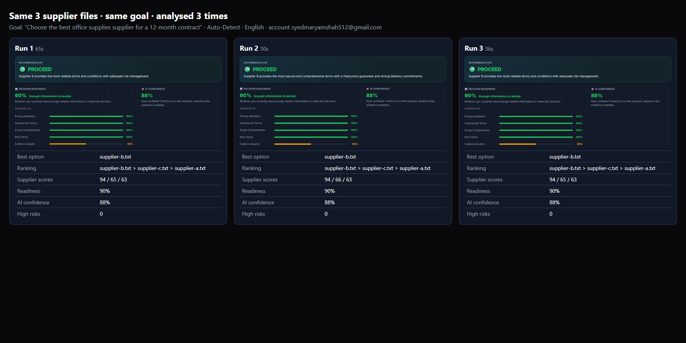

---

## Contents
1. [Summary](#1-summary)
2. [Why the results used to vary](#2-why-the-results-used-to-vary)
3. [What was changed](#3-what-was-changed)
4. [How the decision is calculated now](#4-how-the-decision-is-calculated-now)
5. [How this was tested](#5-how-this-was-tested)
6. [Test results](#6-test-results)
7. [Findings in detail (including the 2 checks that did not pass)](#7-findings-in-detail-including-the-2-checks-that-did-not-pass)
8. [Things to know before launch](#8-things-to-know-before-launch)
9. [Screenshot walkthrough](#9-screenshot-walkthrough)
10. [Appendix — files changed, test documents, how to re-run](#10-appendix)

---

## 1. Summary

| | Before the fix | After the fix |
|---|---|---|
| Who decides the ranking and verdict | The AI, freely, on every run | Fixed rules in code, applied to a checklist |
| AI randomness (temperature) | Default (1.0), the most random setting | 0, the most repeatable setting, with a fixed seed |
| AI model version | Floating alias `gpt-4o`, which OpenAI can change without notice | Pinned to `gpt-4o-2024-08-06` (the exact version the alias pointed to, so quality is unchanged) |
| Decision Readiness | A number the AI picked for 4 **or** 5 factors it chose itself | Always the same factors per document type, scored from the checklist |
| Risk severity (High / Medium / Low) | AI judgement | Tied to checklist results (e.g. an unfavourable critical term is always High) |
| Upload order | Could influence the AI | Documents are sorted before analysis, so order has no effect |
| File names in the ranking | Sometimes company names, sometimes file names | Always the uploaded file names |

**What still varies, on purpose:** the wording of the explanations. The AI still writes every sentence of the report, so phrasing differs slightly between runs. The client said this is fine. The **decision itself** no longer changes.

---

## 2. Why the results used to vary

The whole analysis flow was inspected: upload → text extraction → prompt → AI call → report cleanup → report page. Text extraction was confirmed to be exact, so the same file always gives the AI the same text. The variation came entirely from how the AI was used:

1. **Randomness was switched on.** No `temperature` was set, so the AI ran at its default of 1.0. That setting is designed for creative writing: it deliberately picks different words, and sometimes different conclusions, on each run.
2. **The AI chose the verdict before reviewing the evidence.** The report was produced in one pass, and the output format asked for the recommendation, the verdict and the ranking *first*, with the risks and evidence *after*. Once the AI had picked a verdict, the rest of the report was written to justify it.
3. **Scores had no scoring guide.** Readiness factors were "0–100" with almost no definition. The same fact could be scored 55 on one run and 75 on the next. The AI also chose whether to use 4 or 5 factors, so readiness was sometimes an average over different sets of factors.
4. **Ranking was an overall impression.** There were no weights and no per-supplier scores. When two suppliers were close, the winner could flip.
5. **Small wobbles crossed hard thresholds.** A readiness of 49 vs 51 changed the headline from "Proceed" to "Proceed with Caution".
6. **The number and severity of risks were open-ended.** "Surface hidden risks even when documents appear clean" led to a different set of risks each run.
7. **The document type was re-guessed every run** in Auto-Detect mode, which changed which expert rules applied.
8. **The model version was not pinned**, so results could also drift over weeks as OpenAI updated the alias.

---

## 3. What was changed

A report is now built in **three steps instead of one**:

```
 Uploaded documents
        │
        ▼
 ① CHECKLIST STEP (AI, strict format, temperature 0)
    For each document, record the status of each checklist item —
    Adequate / Partial / Missing / Unfavorable — and the prices it states.
    Facts only. No opinion, no ranking, no verdict.
        │
        ▼
 ② SCORING STEP (code — no AI)
    Fixed weights and rules turn the checklist into:
    supplier scores → ranking → Decision Readiness → verdict →
    AI confidence → decision strength
        │
        ▼
 ③ REPORT WRITING STEP (AI, temperature 0)
    The AI receives the results from step ② marked as FINAL and writes the
    explanations, risks, questions, negotiation points, playbook, etc.
    around them. Before the report is saved, the code enforces the
    computed values again.
```

Additional safeguards:
- **Fallback:** if step ① fails for any reason (timeout, unusable answer), the report is still produced the previous way, so the customer never loses a report or credits because of this change.
- **Consistency guards:** when the checklist results are present, the code overwrites the verdict, ranking, readiness, confidence and decision strength with the computed values. It also removes any "Which option fits your priority" line that names a different supplier as the *overall / balanced* choice, because that would contradict "Current Best Option".
- **Transparency:** each new report stores exactly what its decision was based on (`decision_basis`): every supplier's checklist, score, compared prices and the rules applied. It is saved with the report and can be shown to users later if wanted.
- **Older reports:** reports saved before this change still open and display normally.

---

## 4. How the decision is calculated now

### 4.1 The checklist

Each document type has a fixed checklist. Items marked **critical** can block a "Proceed". Supplier quotations are the case the client raised:

| Checklist item | Weight | Critical | Feeds readiness factor |
|---|---|---|---|
| Pricing transparency | 3 | ✔ | Pricing Validation |
| Fixed price period | 1 | | Pricing Validation |
| Price increase cap | 1 | | Pricing Validation |
| Payment terms | 2 | ✔ | Commercial Terms |
| Cancellation terms | 1 | | Commercial Terms |
| Scope of supply | 2 | ✔ | Scope Completeness |
| Delivery commitment | 2 | ✔ | Scope Completeness |
| Late delivery penalty | 1 | | Scope Completeness |
| Warranty terms | 2 | | Risk Clarity |
| Liability & insurance | 2 | ✔ | Risk Clarity |
| Service levels & support | 1 | | Risk Clarity |
| Past performance evidence | 2 | | Evidence Quality |

CVs, contracts, business proposals and general documents each have their own list (9–11 items), defined in `api/_lib/decisionScoring.ts`.

**Status meanings** (the AI must choose one per item, per document):

| Status | Meaning | Example |
|---|---|---|
| Adequate | Clearly and specifically stated, acceptable for the buyer | "Prices locked for 12 months" |
| Partial | Mentioned but vague, estimated, conditional or "on request" | "Estimated delivery 5–10 days" |
| Missing | Not addressed at all | No warranty section |
| Unfavorable | Clearly stated but one-sided or harmful | "Prices subject to change without notice", "50% advance payment" |

The AI judges each document **on its own**, never by comparing it with the others. File names and upload order are never evidence.

### 4.2 Supplier score and ranking

- **Terms score (0–100):** weighted average of the checklist, with Adequate = 100, Partial = 50, Missing = 20, Unfavorable = 0.
- **Price score (0–100):** only when every supplier quotes the same items in the same currency. The prices of those shared items are added up per supplier; the cheapest gets 100 and the others get `100 × cheapest ÷ their total`. Delivery charges, taxes and optional extras are excluded.
- **Final score** = terms × (1 − w) + price × w, where **w** depends on the Decision Goal:

| The Decision Goal… | Price weight w |
|---|---|
| explicitly prioritises lowest cost / budget | 45% |
| does not prioritise either (default) | 25% |
| explicitly prioritises reliability / risk / compliance | 10% |

- **Ranking:** by final score. Ties are broken by fewer unfavourable critical terms, then lower price, then name, so two suppliers can never swap places at random.

### 4.3 Decision Readiness

For the best-ranked option, each readiness factor is the weighted average of its checklist items, scored for **how complete the information is**: Adequate = 100, Unfavorable = 100 (the term is clear, even if bad), Partial = 50, Missing = 0. Decision Readiness is the weighted average of every checklist item, using the same item weights as the ranking, and the factors are shown beside it as the breakdown of where information is thin.

Readiness was previously the plain average of the five factor scores. That gave a factor with one checklist item (Evidence Quality on a supplier quotation) the same fifth of the score as the three pricing items together, so one borderline reading — "references available on request": Adequate or Partial? — moved Decision Readiness by 10 points between two runs of the same documents. Weighting by item halves that movement and counts a critical term for more than a minor one. The AI only translates the factor names into the report language.

### 4.4 The verdict

| Verdict | Rule (applied to the best-ranked option) |
|---|---|
| **Do Not Proceed** | 2 or more critical terms are Unfavorable, **or** its terms score is below 35 |
| **Proceed** | No critical term is Missing or Unfavorable **and** Decision Readiness is 70 or higher |
| **Proceed with Caution** | Everything else |

### 4.5 AI confidence, decision strength, risk severity

- **AI confidence** = 50 + 30 × (share of checklist items the documents answer) + 20 × (share of those answers that are clear rather than vague), minus 10 if a document was too long and had to be cut.
- **Decision strength (1–5)** follows the verdict: Proceed = 5 when the best option leads by 10+ points, otherwise 4; Caution = 3, or 2 when readiness is below 60; Do Not Proceed = 4 when two critical terms are unfavourable, otherwise 3.
- **Risk severity** is tied to the checklist: an Unfavorable critical item → **High**; any other Unfavorable item, or a Missing critical item → **Medium**; a Partial or Missing non-critical item → **Low**.

### 4.6 Worked example from the test

What the checklist step recorded for the three test quotations (run 1):

| | Supplier B | Supplier C | Supplier A |
|---|---|---|---|
| Pricing transparency* | Adequate | Adequate | Adequate |
| Fixed price period | Adequate | Partial | **Unfavorable** |
| Price increase cap | Adequate | Missing | Missing |
| Payment terms* | Adequate | **Unfavorable** (50% advance) | Adequate |
| Cancellation terms | Adequate | Partial | **Unfavorable** |
| Scope of supply* | Adequate | Adequate | Adequate |
| Delivery commitment* | Adequate | Partial | Partial |
| Late delivery penalty | Adequate | Missing | Missing |
| Warranty terms | Adequate | Partial | Partial |
| Liability & insurance* | Adequate | Partial | **Unfavorable** |
| Service levels & support | Adequate | Missing | Missing |
| Past performance evidence | Partial | Partial | Missing |
| **Compared price** (paper + cartridge + stationery) | $81.70 | $76.00 | $75.50 |
| **Terms score** | 95 | 53 | 50 |
| **Final score** (balanced goal, 25% price) | **94** | 65 | 63 |
| **Rank** | 🥇 1 | 🥈 2 | 🥉 3 |

Supplier B has no critical gaps and a readiness of 90, so the verdict is **Proceed**. Readiness factors: Pricing Validation 100, Commercial Terms 100, Scope Completeness 100, Risk Clarity 100, Evidence Quality 50 (references only "available on request").

---

## 5. How this was tested

- **Real engine, real app, real account.** Every report was produced by the actual analysis code calling OpenAI, through the running TimeCut web app, signed in as the client's test account `syedmaryamshah512@gmail.com` (Pro plan). Nothing was mocked.
- **Browser automation with Playwright.** A script used Chrome like a customer: sign in, upload **3 supplier quotations together**, type the Decision Goal, click *Analyze Decision*, wait for the report, read what the page shows, take screenshots, reload the page, and move on to the next run.
- **Same inputs every time.** Same 3 files (`supplier-a.txt`, `supplier-b.txt`, `supplier-c.txt`), same goal *"Choose the best office supplies supplier for a 12-month contract"*, Auto-Detect, English.
- **Page and data both checked.** Each run compared what the page shows with the data the server returned, so a mismatch between the computed decision and the display would be caught.
- **Regression coverage.** Public pages, sign-in, credits, a second language with a chosen framework, an unreadable file, profile history, the Decision Assistant, and an old report saved before the change.
- **Stability script.** `scripts/verify-report-stability.ts` ran the same analysis 5 times in a row outside the browser and reported how often the results agreed.
- **Offline checks.** 24 checks of the scoring rules and report cleanup, with no AI involved (edge cases like one document, bad AI answers, old reports).
- **Build checks.** TypeScript (app and API), lint, and the production build.
- **Before vs after.** The same stability script was run on the **old** code before any change, so the two can be compared directly.

---

## 6. Test results

### 6.1 Before vs after — the stability script (same 3 files, 5 runs each)

| | Old code | New code |
|---|---|---|
| Best option | supplier-b in **4/5** runs (1 run ranked by company names instead) | supplier-b in **5/5** runs |
| Full ranking | same in **4/5** runs | same in **5/5** runs |
| Verdict | Proceed with Caution 5/5 | Proceed 5/5 |
| Decision Readiness | **79 – 82** (moved every run) | **90 – 90** (identical) |
| AI confidence | 85 – 85 | 88 – 88 |
| High risks | 1 – 1 | 0 – 0 |
| Time per report (AI part) | 30 – 34 s | 25 – 35 s |

> These three quotations are very different from each other, so even the old code was fairly consistent on them. Where the old behaviour really hurt was on **close** comparisons: a readiness wobble across 50, or two suppliers a few points apart, could flip the headline or the winner. The new calculation removes that randomness entirely, because a result can only change if the checklist reading of the documents changes.

### 6.2 In-app test — 3 identical analyses (Playwright)

| Run | Time | Verdict | Ranking | Readiness | Confidence | Factor scores | Supplier scores | High risks |
|---|---|---|---|---|---|---|---|---|
| 1 | 65.4 s* | Proceed | B > C > A | 90% | 88% | 100/100/100/100/50 | 94 / 65 / 63 | 0 |
| 2 | 30.2 s | Proceed | B > C > A | 90% | 88% | 100/100/100/100/50 | 94 / **66** / 63 | 0 |
| 3 | 35.9 s | Proceed | B > C > A | 90% | 88% | 100/100/100/100/50 | 94 / 65 / 63 | 0 |

\* End-to-end in the browser (upload + sign-in check + credit charge + AI + save). See [section 7.3](#73-first-report-after-a-pause-is-slower).

The same result was also seen in the earlier test round today: 2 further identical runs, both **Proceed · B > C > A · 90% · 88%**.

### 6.3 All in-app checks — 78 / 80 passed

**Public pages (12/12)**

| Check | Result |
|---|---|
| `/`, `/how-it-works`, `/features`, `/examples`, `/pricing`, `/blog`, `/faq`, `/about`, `/security`, `/contact`, `/privacy`, `/terms` all load | ✅ Pass (12) |

**Account & credits (2/2)**

| Check | Result |
|---|---|
| Sign in with the test account | ✅ Pass |
| AI Credits charged once per report (2,840 → 2,786 for 3 reports, 18 each) | ✅ Pass |

**Each of the 3 identical runs (9 checks × 3 = 27/27)**

| Check | Run 1 | Run 2 | Run 3 |
|---|---|---|---|
| 3 files uploaded together | ✅ | ✅ | ✅ |
| Report generated | ✅ | ✅ | ✅ |
| Decision computed from the checklist (not guessed by the AI) | ✅ | ✅ | ✅ |
| Verdict on page = computed verdict | ✅ | ✅ | ✅ |
| Ranking on page = computed order | ✅ | ✅ | ✅ |
| Readiness on page = computed readiness | ✅ | ✅ | ✅ |
| Best option on page is ranking #1 | ✅ | ✅ | ✅ |
| "Which option fits your priority" never names another option as best overall | ✅ | ✅ | ✅ |
| Saved report is identical after a page reload | ✅ | ✅ | ✅ |

**Stability across the 3 runs (8/9)**

| Check | Result |
|---|---|
| Same best option | ✅ Pass |
| Same full ranking | ✅ Pass |
| Same verdict | ✅ Pass |
| Same Decision Readiness | ✅ Pass |
| Same readiness factor scores | ✅ Pass |
| Same AI confidence | ✅ Pass |
| Same document type | ✅ Pass |
| Same number of High risks | ✅ Pass |
| Same internal supplier scores | ❌ Supplier C: 65 / 66 / 65. See [7.1](#71-supplier-c-scored-65-66-65) |

**Chinese report with "Supplier Quotation" selected (13/13)**

| Check | Result |
|---|---|
| The 9 per-run checks above | ✅ Pass (9) |
| The selected framework is used | ✅ Pass |
| Readiness factor names shown in Chinese (价格验证, 商业条款, 范围完整性, 风险清晰度, 证据质量) | ✅ Pass |
| Same best option as the English runs | ✅ Pass |
| Same verdict as the English runs | ✅ Pass |

**Unreadable file (12/12)**, uploaded as `supplier-a.txt` + `supplier-b.txt` + an empty `empty-notes.txt`

| Check | Result |
|---|---|
| The 9 per-run checks above | ✅ Pass (9) |
| The server reports the empty file as skipped | ✅ Pass |
| Only the 2 readable documents are ranked | ✅ Pass |
| The "One uploaded file was not analysed" notice is shown | ✅ Pass |

**Existing features (4/4)**

| Check | Result |
|---|---|
| Saved reports are listed on the profile | ✅ Pass |
| Newest report opens from the profile | ✅ Pass |
| Decision Assistant answers a question about the report | ✅ Pass |
| A report saved **before** this change still opens and renders | ✅ Pass |

**Browser console (0/1)**

| Check | Result |
|---|---|
| No browser console errors during the whole test | ❌ 3 Firestore connection warnings. See [7.2](#72-browser-console-warnings) |

### 6.4 Offline checks — 24 / 24 passed

| # | Check | Result |
|---|---|---|
| 1 | Scores are computed from a checklist | ✅ Pass |
| 2 | The option with better terms ranks first | ✅ Pass |
| 3 | Upload order does not change the result | ✅ Pass |
| 4 | Prices compared only on items every option quotes | ✅ Pass |
| 5 | No critical gaps + readiness ≥ 70 → Proceed | ✅ Pass |
| 6 | Two critical Unfavorable terms → Do Not Proceed | ✅ Pass |
| 7 | Single document: no price comparison | ✅ Pass |
| 8 | A critical item missing → Proceed with Caution | ✅ Pass |
| 9 | Empty checklist answer → safe fallback | ✅ Pass |
| 10 | Unknown document type → safe fallback | ✅ Pass |
| 11 | Wrong checklist answered → safe fallback | ✅ Pass |
| 12 | A framework chosen by the user overrides Auto-Detect | ✅ Pass |
| 13 | A single document is not penalised for "comparability" | ✅ Pass |
| 14 | AI verdict is replaced by the computed verdict | ✅ Pass |
| 15 | AI confidence is replaced by the computed confidence | ✅ Pass |
| 16 | Ranking uses the computed order and real file names | ✅ Pass |
| 17 | AI summaries kept even when it used company names | ✅ Pass |
| 18 | Translated factor name kept, score from the checklist | ✅ Pass |
| 19 | Readiness comes from the checklist | ✅ Pass |
| 20 | A "Balanced" priority naming a non-best option is removed | ✅ Pass |
| 21 | Fallback: readiness from the AI factors (old behaviour) | ✅ Pass |
| 22 | Fallback: "Proceed" below readiness 50 becomes Caution | ✅ Pass |
| 23 | Fallback: every document still appears in the ranking | ✅ Pass |
| 24 | A malformed decision basis is ignored | ✅ Pass |

### 6.5 Build checks

| Check | Result |
|---|---|
| TypeScript — web app | ✅ Pass |
| TypeScript — API | ✅ Pass |
| Lint (changed files) | ✅ Pass |
| Production build (`npm run build`) | ✅ Pass (only the existing large-bundle size notice) |

### 6.6 Every report saved on the test account: before vs after

These are the actual reports stored on the account, read directly from the database.

**Before the fix, Sep 13.** Same 2 files (`supplier-a.txt`, `supplier-b.txt`), same goal *"Choose an office supplies supplier for our company. We need reliable delivery and good value for money."*

| Saved | Verdict | Ranking shown | Readiness | Confidence | High risks |
|---|---|---|---|---|---|
| 11:29 | Proceed with Caution | supplier-b only | **80** | **85** | **0** |
| 11:32 | Proceed with Caution | supplier-b only | **78** | **85** | **1** |
| 11:45 | Proceed with Caution | supplier-b > supplier-a | **80** | **90** | **0** |

Readiness, confidence and the High-risk count all moved, and 2 of the 3 rankings left out the second supplier. This is the behaviour the client reported.

**After the fix, Sep 15.** Same 3 files, same goal *"Choose the best office supplies supplier for a 12-month contract"*

| Saved | Framework | Verdict | Ranking | Readiness | Confidence | High risks |
|---|---|---|---|---|---|---|
| 08:33 | Auto | Proceed | B > C > A | 90 | 88 | 0 |
| 08:34 | Auto | Proceed | B > C > A | 90 | 88 | 0 |
| 08:35 | Auto | Proceed | B > C > A | 90 | 88 | 0 |
| 08:37 | Supplier (Chinese) | Proceed | B > C > A | 90 | 88 | 1 |
| 08:40 | Auto | Proceed | B > C > A | 90 | 88 | 0 |
| 08:41 | Auto | Proceed | B > C > A | 90 | 88 | 0 |
| 09:21 | Auto | Proceed | B > C > A | 90 | 88 | 0 |
| 09:22 | Auto | Proceed | B > C > A | 90 | 88 | 0 |
| 09:23 | Auto | Proceed | B > C > A | 90 | 88 | 0 |
| 09:24 | Supplier (Chinese) | Proceed | B > C > A | 90 | 88 | 0 |

The 11th report (09:24, 2 readable files + the empty test file) is a different input: Proceed · B > A · readiness 90 · confidence 92.

---

## 7. Findings in detail (including the 2 checks that did not pass)

### 7.1 Supplier C scored 65, 66, 65

In run 2, the checklist step read Supplier C's line *"Late delivery: customer may cancel the affected order line; no financial penalty"* as **Partial** instead of **Missing**. Both readings are defensible. Supplier C's internal score moved by 1 point.

**Nothing the customer sees changed:** ranking, verdict, readiness, factor scores and confidence were identical. This is the "stable within a consistent range" behaviour the client asked for:
- **Why it can still happen:** OpenAI does not guarantee bit-for-bit identical output even at temperature 0 with a fixed seed, so a borderline wording can occasionally be read one step differently.
- **How far it can go:** one checklist item moving one step changes a score by a few points at most. It can only change the ranking or verdict when two suppliers are almost tied or a score sits exactly on a rule boundary.
- **Why the report shows it:** it is included as an honest measure of the remaining range, not treated as a defect.

### 7.2 Browser console warnings

The 3 messages were all *"Could not reach Cloud Firestore backend… Connection failed 1 times"* while opening `/`, `/privacy` and `/terms`. This is the Firebase library reporting a brief network hiccup to Google's servers from the test machine; it recovered on its own, and every page and report loaded normally. The report generation code does not touch these pages, and no errors came from the report page itself.

### 7.3 First report after a pause is slower

End-to-end times in the browser were 65.4 s for the first report, then 30–36 s for every report after it. The AI part alone consistently takes **30–36 s** (stability script and later runs). The extra time on the first run is the local development server warming up and connecting to Firebase (it coincided with the Firestore connection warnings above). The production route is limited to 60 s. The code has its own 50-second deadline for the AI calls and refunds credits if it is reached, but see recommendation 8.2.

### 7.4 The plan's 3-document limit

The test account's plan allows **3 documents per report**. When 4 files were added, the upload form correctly kept 3 and showed *"Your plan allows up to 3 documents per report"*. That is why the unreadable-file test used 3 files in total. This is existing behaviour and was working correctly.

### 7.5 What still differs between runs

The wording of the headline, summaries and risk descriptions. For example, run 1 said *"Supplier B provides the most reliable terms and conditions with adequate risk management"* and run 2 said *"…the most secure and comprehensive terms with a fixed price guarantee and strong delivery commitments"*. Both say the same thing. This was confirmed as acceptable.

The **risk list** is also still written by the AI. It follows the fixed severity rules in [4.5](#45-ai-confidence-decision-strength-risk-severity), but it is not recalculated by code the way the verdict and scores are. Across the 10 same-input reports in [6.6](#66-every-report-saved-on-the-test-account-before-vs-after), 9 listed no High risk and one, a Chinese report, listed one. The verdict, ranking and readiness were unaffected. If the client wants the risk list locked down as tightly as the scores, the next step would be to generate the High/Medium risk entries directly from the checklist in code.

---

## 8. Things to know before launch

### 8.1 OpenAI rate limit — action recommended
The OpenAI account is limited to **30,000 tokens per minute** for gpt-4o. A report now uses about 11,000 tokens (it was about 7,500). So roughly **2–3 reports starting in the same minute** can hit OpenAI's limit, and the extra customers get an error with their credits refunded. This was observed during testing when 5 reports were started at once. **Recommendation:** raise the OpenAI usage tier (limits increase automatically as spend grows, or can be requested) before launch traffic.

### 8.2 Route time limit
Reports take 30–36 s, inside the 60 s limit, but a slow first request can come close. **Recommendation:** if the Vercel plan allows it, raise `maxDuration` for `api/analyze-decision.ts` (e.g. to 90 s) for extra headroom.

### 8.3 Cost per report
The checklist step adds about 2,700 input and 600 output tokens. For the three test quotations, the OpenAI cost goes from about **$0.035 to about $0.048 per report** (roughly one cent more). The credit prices charged to customers are unchanged (18 credits here).

### 8.4 The scoring rules are a business decision
The weights, the critical items and the verdict thresholds in [section 4](#4-how-the-decision-is-calculated-now) are sensible defaults, not fixed truths. They live in one file (`api/_lib/decisionScoring.ts`) and can be tuned. For example, price could count for more by default, or "Past performance evidence" could be made critical. Changing a rule changes future results consistently for everyone.

### 8.5 Re-check stability after any prompt or rule change
Run the stability script (see [appendix](#10-appendix)) on a set of sample documents after changing prompts, rules or the model, to confirm the results still agree run to run.

---

## 9. Screenshot walkthrough

All screenshots are in [`stability-report-screenshots/`](stability-report-screenshots/). The raw test output is in `stability-report-screenshots/test-results.json`.

### Signing in with the test account
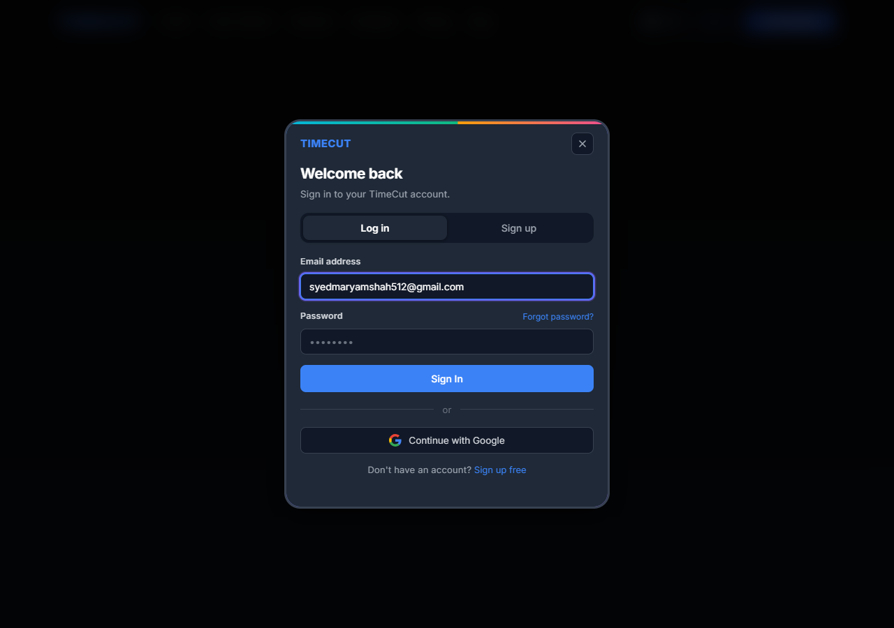

### Uploading the same 3 supplier quotations together
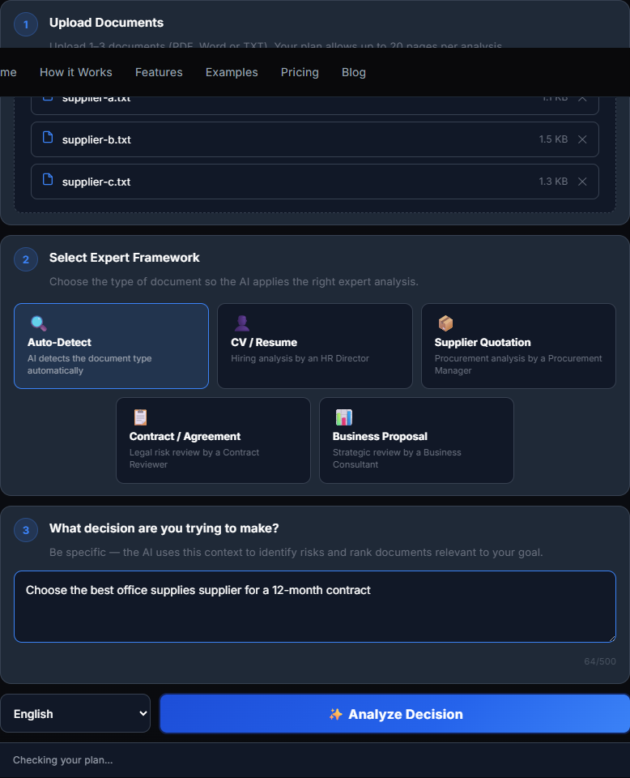

### While the analysis runs
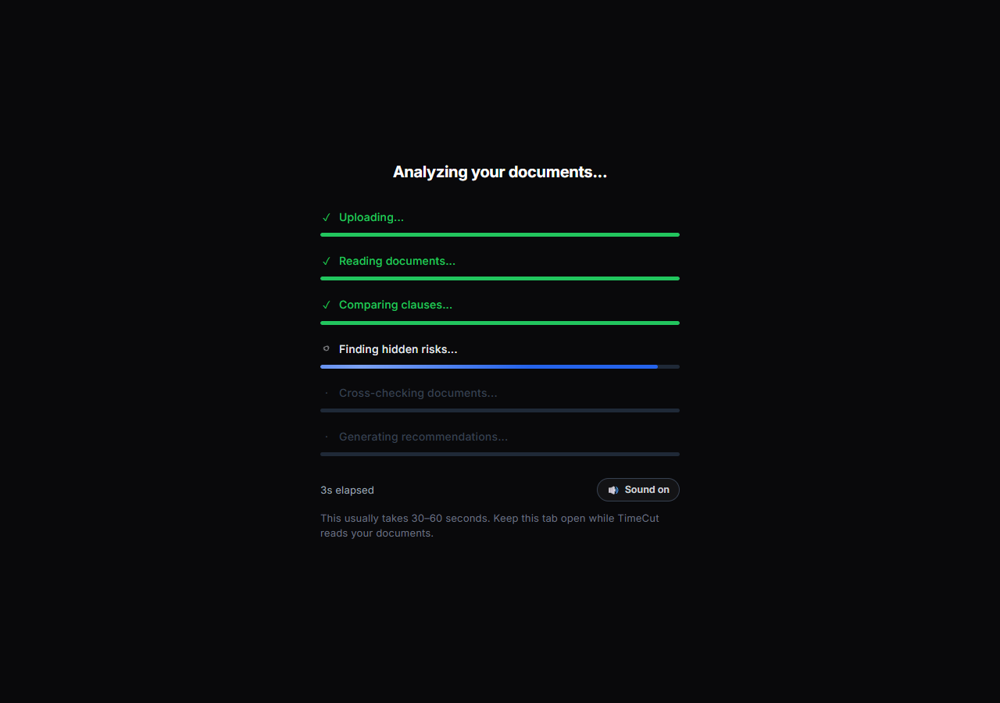

### The report — run 1, run 2, run 3
**Run 1**
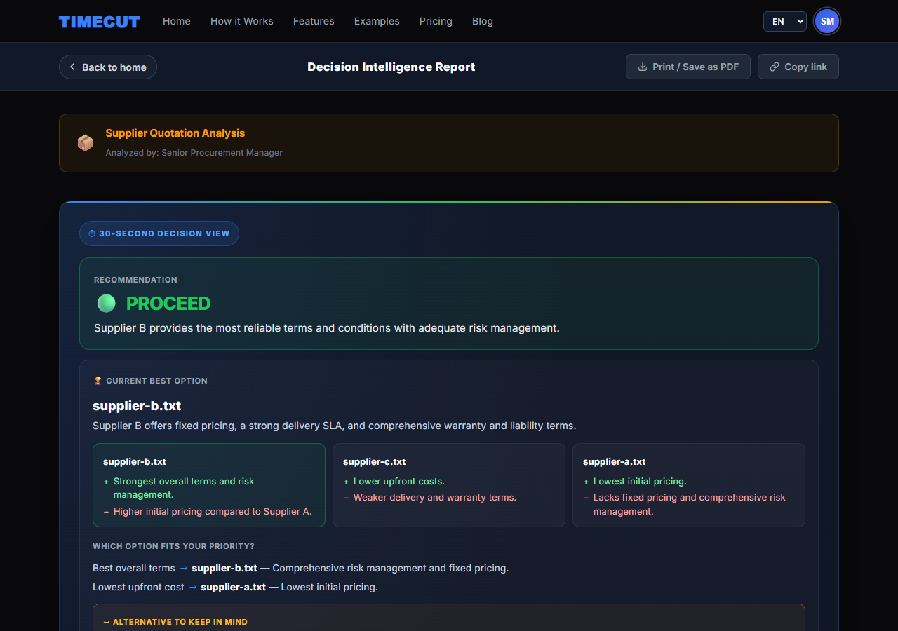

**Run 2**
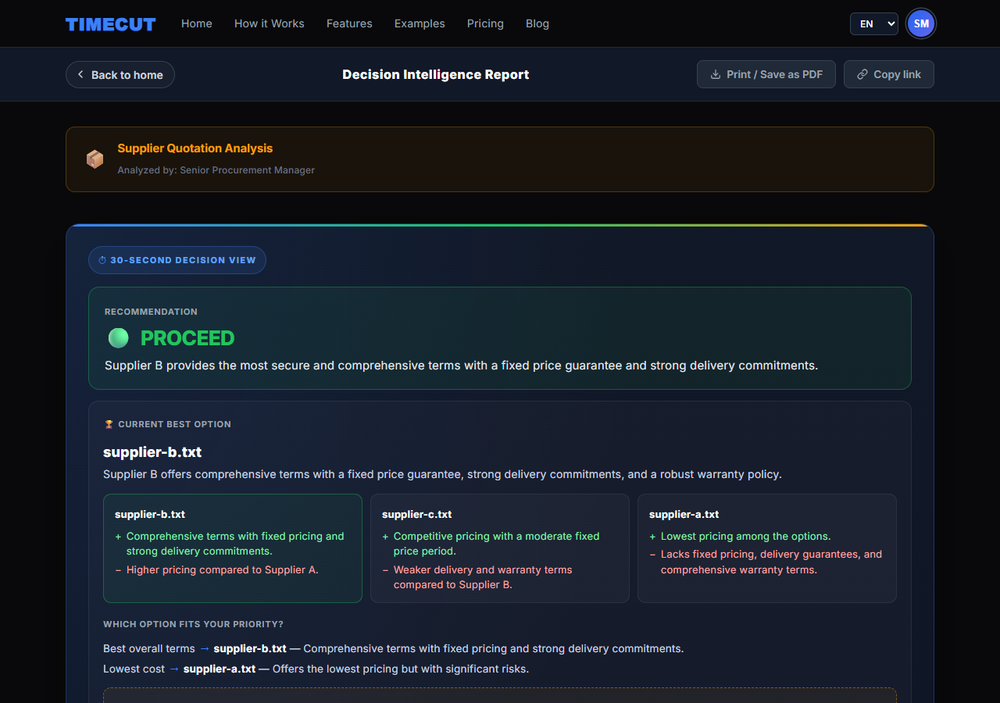

**Run 3**
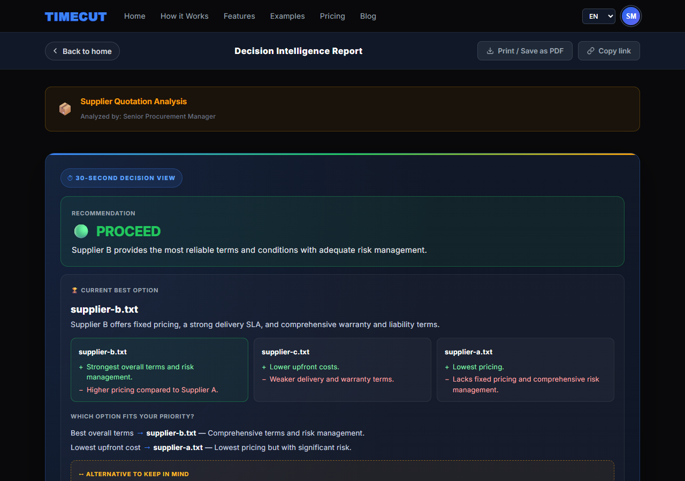

### Decision Readiness — identical factors and scores on every run
| Run 1 | Run 2 | Run 3 |
|---|---|---|
| 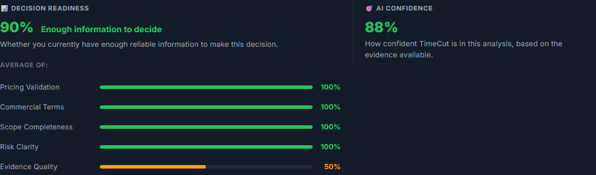 |  |  |

### Document ranking — identical order on every run
| Run 1 | Run 2 | Run 3 |
|---|---|---|
| 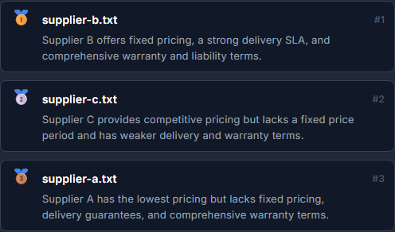 | 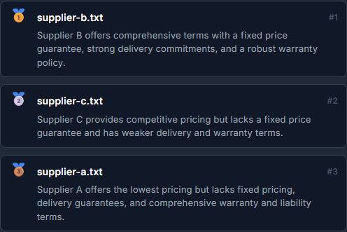 | 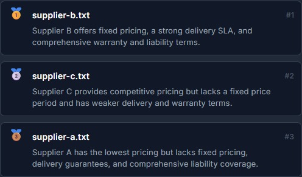 |

### The complete report (run 1, full page)
[Open the full-page screenshot](stability-report-screenshots/run1-07-report-full-page.png) (very tall image)

### Chinese report with "Supplier Quotation" selected
Same decision, and the readiness factor names are translated.
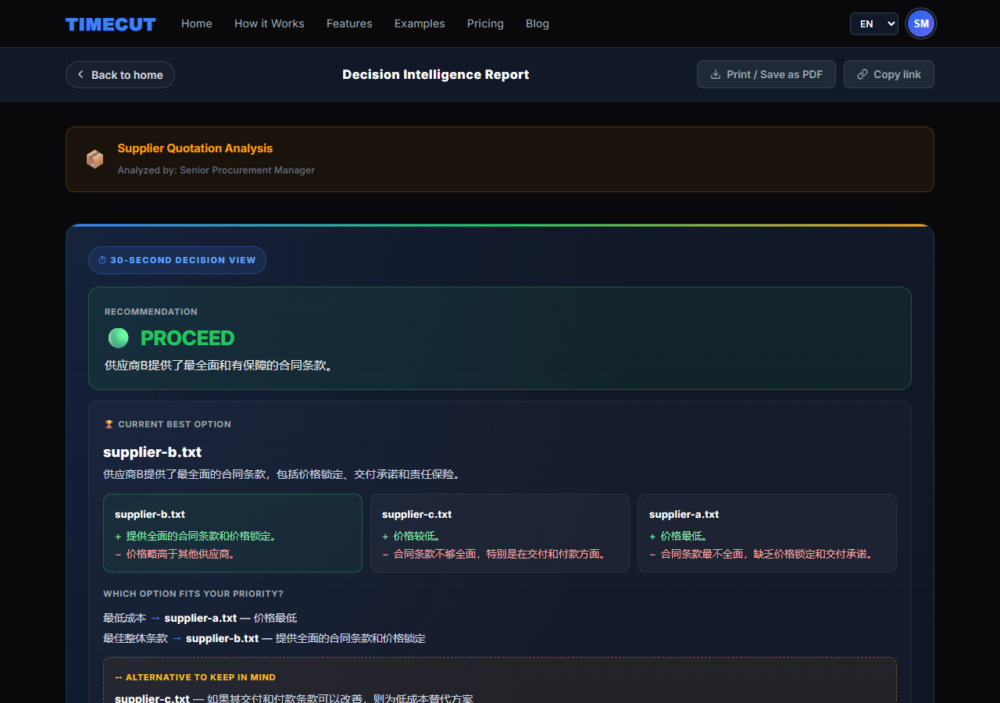


### An unreadable file is reported, not silently ignored
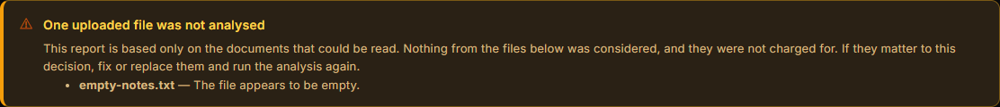

### Reports are saved to the profile
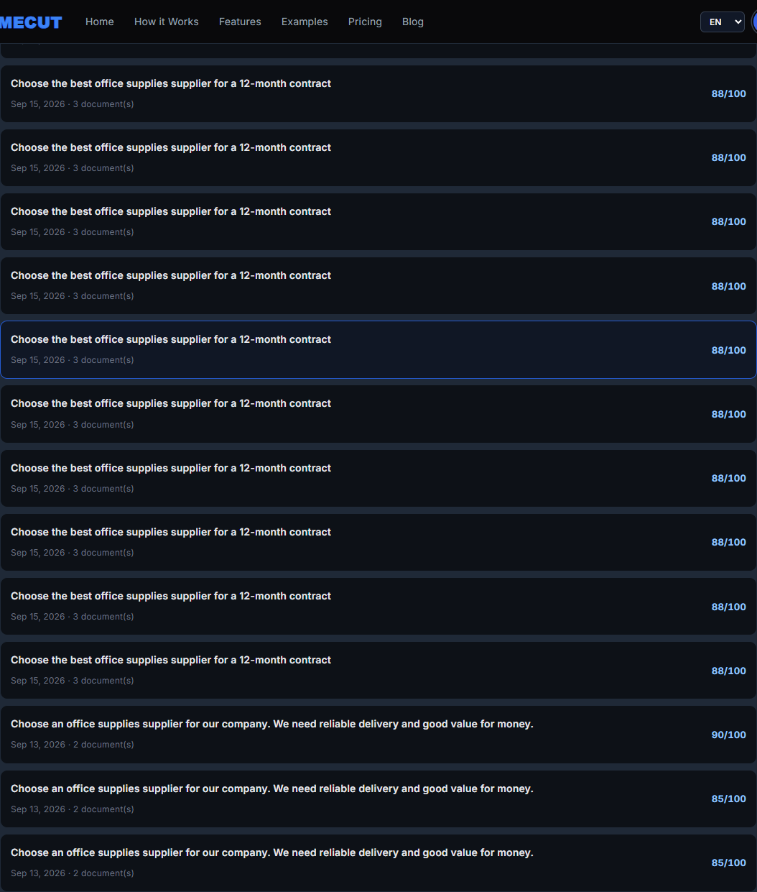

### The Decision Assistant still works
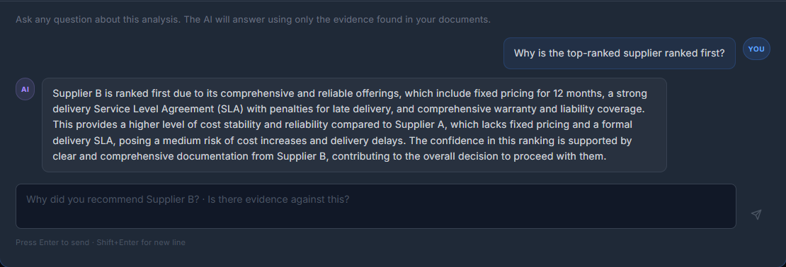

### A report saved before this change still opens
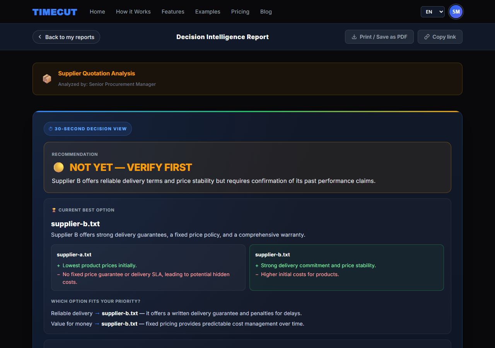

---

## 10. Appendix

### 10.1 Files changed

| File | Change |
|---|---|
| `api/_lib/decisionScoring.ts` | **New.** Checklists per document type, the checklist-step prompt and strict output format, and all scoring rules (ranking, readiness, verdict, confidence, strength). |
| `api/_lib/shared.ts` | Report generation now runs the checklist step first and passes the computed results to the report writer; temperature 0 + seed; documents sorted; risk severity and "choose if" rules added to the prompt; the report cleanup enforces the computed values; safe fallback. |
| `api/_lib/aiConfig.ts` | Model pinned to `gpt-4o-2024-08-06`; shared sampling settings; checklist-step deadline; token usage of both calls combined for the Admin cost figures. |
| `src/types.ts` | Optional `decision_basis` and readiness factor `key` added to the report type (older reports are unaffected). |
| `scripts/verify-report-stability.ts` | **New.** Repeats an analysis N times and prints how often the results agree. |

No changes were made to the upload form, the report page layout, plans, credits, payments or the Decision Assistant.

### 10.2 Test documents
Copies are in `stability-report-screenshots/test-documents/`:
- `supplier-a.txt`: Alpha Office Solutions, lowest prices, weak terms
- `supplier-b.txt`: Beta Supply Co., highest prices, strongest terms
- `supplier-c.txt`: Gamma Workplace Supplies, middle prices, mixed terms (50% advance payment)
- `empty-notes.txt`: an intentionally empty file, used for the skipped-file test

### 10.3 How to re-run the stability check
```bash
npx tsx scripts/verify-report-stability.ts --runs 5 \
  stability-report-screenshots/test-documents/supplier-a.txt \
  stability-report-screenshots/test-documents/supplier-b.txt \
  stability-report-screenshots/test-documents/supplier-c.txt
```
Options: `--goal "..."`, `--type auto|supplier_quotation|contract|business_proposal|cv|general`, `--language "Chinese (Simplified)"`. Each run costs about $0.05 of OpenAI usage and no customer credits. Runs one at a time to stay under the OpenAI rate limit.

### 10.4 Credits used by this testing
Final test round: 5 reports (17–18 credits each) + 1 Decision Assistant question, 2,840 → 2,750 credits. Earlier today, the implementation and first test round used 6 reports + 1 question (2,949 → 2,840). The test account has **2,750 of 3,000** credits left this month. The stability script runs used OpenAI directly and did not use customer credits.
